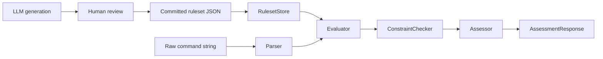
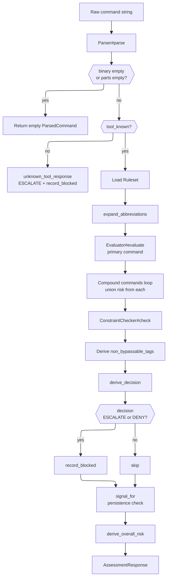
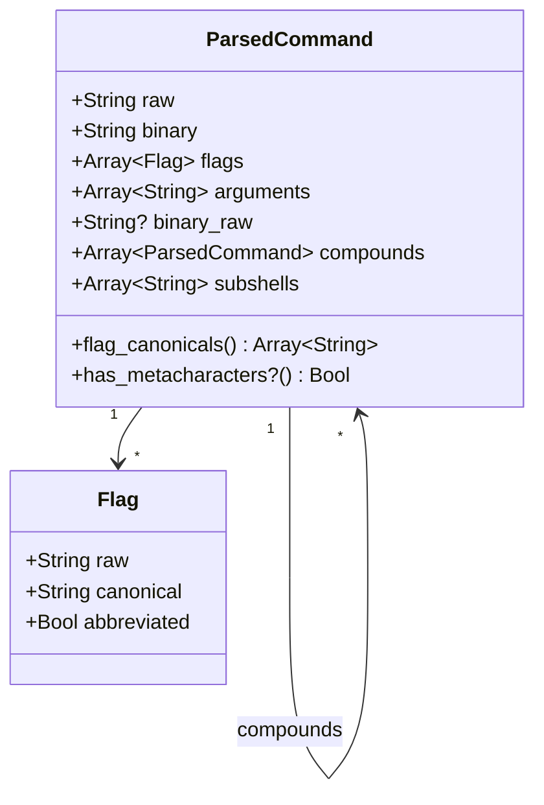
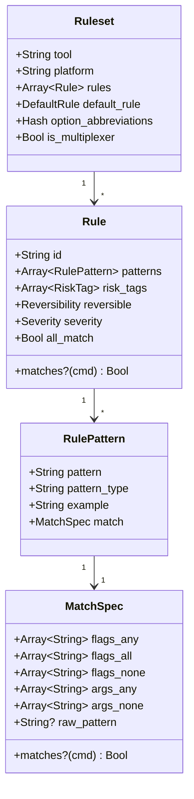
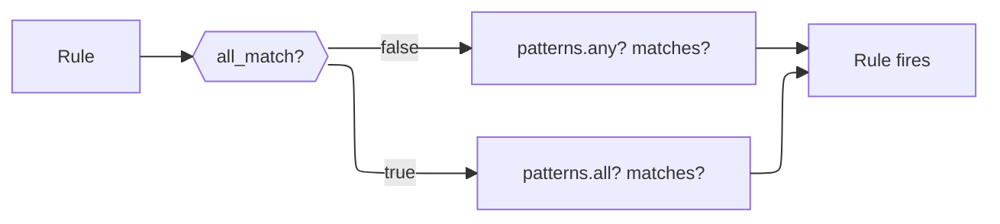
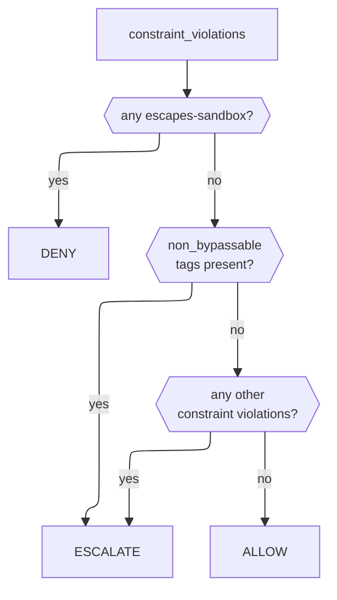
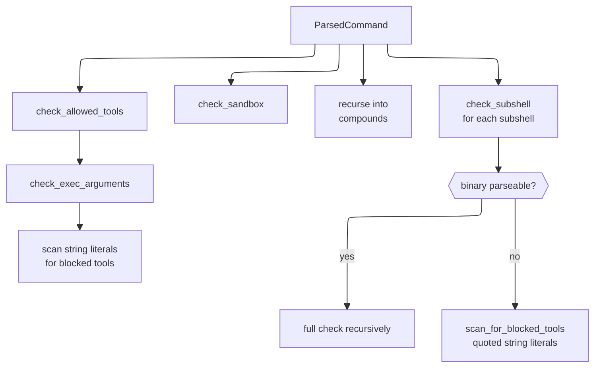
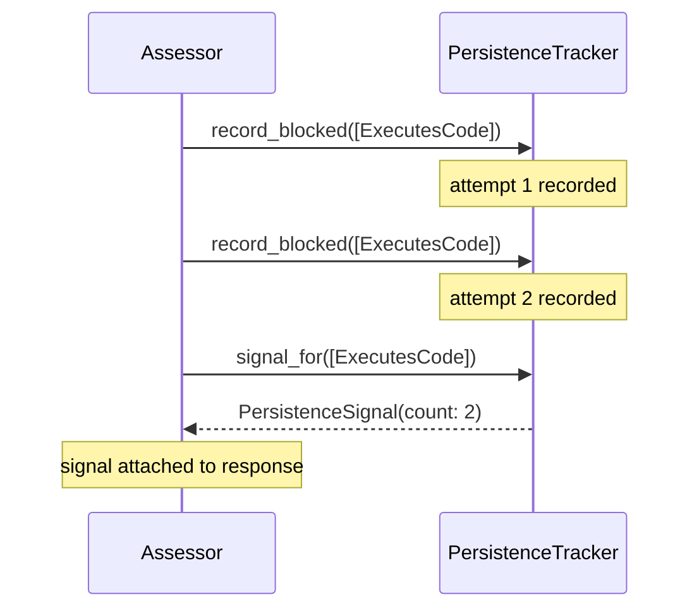

# Development Guide

This document explains how `commandant` works internally — the assessment pipeline, the data model, rule matching semantics, and decision logic. It is written for contributors and maintainers who need to understand, debug, or extend the library.

## Dependencies

1. Make sure you have `ops` installed, in one of the following ways:
 - as a gem via `gem install ops_team` or
 - as a tool via `brew tap nickthecook/crops && brew install ops`
2. If you not using macOS, or a Linux that uses `apt`, please [install Crystal](https://crystal-lang.org/install/)

## Getting started

|Command                        |Description                                                                       |
|-------------------------------|----------------------------------------------------------------------------------|
|`ops up`                       |Gets everything setup including `crystal` via `apt` or `brew` if applicable.      |
|`ops build-debug` or `ops bd`  |Make a debug build of `benchmark` sample, in `bin/debug` folder.                  |
|`ops build-release` or `ops br`|Make a release / production build of `benchmark` sample,  in `bin/release` folder.|
|`ops lint`                     |Run `ameba` on the source code                                                    |
|`ops clean`                    |Remove debug and release build files                                              |
|`ops wipe`                     |In addition to cleaning, remove all compiler caches                               |

### Build and run for development

Use `ops run samples/<SOURCEFILE>` to compile and run the specific source.

### Build to run later

Run `ops build-release` to make a release build in the `bin/release/` folder

Run `ops build-debug` to make a debug build in the `bin/debug/` folder

## How Commandant works

`commandant` intercepts a raw shell command string and returns a structured `AssessmentResponse` before the command executes. The assessment is deterministic, in-process, and does not call any external tools or LLMs at runtime.

The pipeline has two phases:

- **Offline** — rulesets are generated by LLMs, reviewed by humans, and committed to `commandant-rules-core`. They encode the intrinsic risk of a tool's flags and argument patterns. This happens once per tool.
- **Runtime** — for every command string, the library parses, evaluates, and checks constraints. No ruleset generation occurs at runtime.



### Source Layout

```
src/commandant/
  assessment/
    flag.cr               Flag value type
    parsed_command.cr     ParsedCommand value type
    match_spec.cr         MatchSpec — runtime match evaluation
    evaluator.cr          Matches ParsedCommand against Ruleset
    constraint_checker.cr Runtime constraint evaluation
    persistence_tracker.cr Session-window attempt counting
    assessment_response.cr Structured response type
    assessor.cr           Primary public API — orchestrates everything
  ruleset/
    rule.cr               Rule, RulePattern, enums (RiskTag, Severity, Reversibility)
    match_spec.cr         MatchSpec (see above)
    ruleset.cr            Ruleset, DefaultRule
    ruleset_store.cr      Loads and caches rulesets from disk
  parser/
    base.cr               Abstract parser interface
    posix_parser.cr       POSIX shell tokeniser
  platform/
    base.cr               Abstract platform
    posix.cr              Platform::Posix, Platform::Linux, Platform::MacOS
```

### The Assessment Pipeline

This is the full flow through `Assessor#assess`:



#### Step-by-step

**1. Parse** — `PosixParser` tokenises the raw string into a `ParsedCommand` with `binary`, `flags`, `arguments`, `compounds`, and `subshells`. If the string is empty or whitespace-only, an empty `ParsedCommand` is returned immediately.

**2. Tool known check** — if the binary has no committed ruleset, return `unknown_tool_response` (ESCALATE, `tool_known: false`). Record the attempt for persistence tracking. Fail-closed: unknown tools always escalate.

**3. Abbreviation expansion** — if the ruleset has an `option_abbreviations` map, flags in the parsed command are expanded to their canonical forms before evaluation. The original `raw` form is preserved in `Flag#raw`.

**4. Evaluation** — `Evaluator#evaluate` walks the ruleset's rules top-to-bottom. Every rule that matches is collected. If no rule matches, `used_default` is set and the `default_rule` provides the baseline risk tags. All matching rules fire — there is no first-match-wins behaviour.

**5. Compound union** — for each compound command (from `;`, `&&`, `||`), the evaluator runs independently and risk tags, severity, reversibility, and consequences are unioned into the primary response.

**6. Constraint check** — `ConstraintChecker#check` evaluates runtime constraints: allowed-tools list, sandbox boundary, exec-argument scanning, subshell parsing, and string-literal scanning. This is the only phase that depends on deployment-specific configuration.

**7. Non-bypassable tags** — certain risk tags always force ESCALATE or DENY regardless of policy: `executes-code`, `irreversible` (also set when `reversible == No`), and any sandbox escape.

**8. Decision** — derived deterministically from non-bypassable tags and constraint violations. See [Decision Logic](#decision-logic) below.

**9. Persistence signal** — blocked attempts are recorded, then `signal_for` checks whether the same risk category has been attempted ≥ 2 times within the session window. Recording happens before checking so the current attempt counts.

**10. Response** — `AssessmentResponse` is constructed with all derived fields and returned to the caller.

### Data Model

#### ParsedCommand

The output of parsing. A value type (`record`).



`binary_raw` is non-nil only when the binary was unwrapped from a multiplexer (not yet implemented — reserved for `busybox`/`toybox`). `compounds` contains the recursively parsed chained commands. `subshells` contains the raw string content of `$(...)` and backtick expressions.

#### Ruleset

Loaded from JSON at startup. Immutable after load.



### Rule Matching

#### Pattern matching (`MatchSpec#matches?`)

A `MatchSpec` evaluates against a `ParsedCommand` using exact string comparisons — not regex. All criteria must be satisfied (AND logic within a single `MatchSpec`):

|Field        |Condition                                         |
|-------------|--------------------------------------------------|
|`flags_any`  |At least one listed flag is present in the command|
|`flags_all`  |All listed flags are present in the command       |
|`flags_none` |None of the listed flags are present              |
|`args_any`   |At least one listed value appears in arguments    |
|`args_none`  |None of the listed values appear in arguments     |
|`raw_pattern`|The raw command string matches the regex          |

Flag values are compared against `Flag#canonical` — the expanded form after abbreviation resolution.

#### Rule matching (`Rule#matches?`)

A rule has multiple patterns. The `all_match` field controls whether patterns are combined with OR or AND:

- `all_match: false` (default) — any single pattern matching fires the rule
- `all_match: true` — all patterns must match simultaneously



**`all_match: true` is rare.** It is used when two independent patterns must co-fire — for example, a rule requiring both a recursive flag AND a specific argument. In most cases, use `flags_all` within a single `MatchSpec` to require multiple flags.

#### `sed -i` example

The `sed-in-place` rule illustrates `flags_none`:

```json
{
  "id": "sed-in-place",
  "patterns": [{
    "match": {
      "flags_any": ["-i"],
      "flags_none": ["-n"]
    }
  }],
  "risk_tags": ["writes-files", "irreversible"],
  "reversible": "no"
}
```

This fires when `-i` is present but `-n` is absent. The `sed -i -n` combination (in-place with suppressed output) is a different rule with different semantics.

### Decision Logic



#### Non-bypassable tags

Tags that always force ESCALATE regardless of other factors:

|Tag            |Why                                             |
|---------------|------------------------------------------------|
|`executes-code`|Invokes arbitrary code — cannot be auto-approved|
|`irreversible` |Effect cannot be undone — human must confirm    |

`irreversible` is also set programmatically when `reversible == No`, even if `irreversible` is not in the ruleset's `risk_tags` directly.

#### Constraint violations

|Violation              |Decision                |
|-----------------------|------------------------|
|`escapes-sandbox`      |Always DENY (hard block)|
|`escapes-allowed-tools`|ESCALATE                |

#### Overall risk derivation

```
DENY                              → Critical
ERROR severity                    → High
Irreversible AND Recursive        → High
WARNING severity                  → Medium
INFO severity (default)           → Low
```

### Constraint Checking

`ConstraintChecker` is the only component that depends on deployment configuration. It runs after evaluation and checks the same `ParsedCommand` for policy violations.



#### Capability tunneling detection

Three layers catch blocked tools invoked indirectly:

1. **`check_exec_arguments`** — scans argument tokens after `-exec`, `-execdir`, `-ok`, `-okdir` flags. Catches `find . -exec shards install \;`.

2. **`scan_for_blocked_tools` on arguments** — scans quoted string literals within every argument. Catches `crystal eval 'Process.exec("shards", ...)'`.

3. **Subshell parsing** — `$()` and backtick contents are parsed as commands and run through the full check recursively. Catches `grep $(shards list) file.txt`.

### Persistence Tracking

`PersistenceTracker` maintains a session-window log of blocked risk tags. When the same risk category is attempted ≥ 2 times within the window (default 5 minutes), a `PersistenceSignal` is attached to the response.

This is a lightweight observable — it does not block execution. Its purpose is to surface capability tunneling patterns where an agent repeatedly attempts a blocked capability via different command paths.



**Important:** `record_blocked` is called before `signal_for` within the same assessment. This means the current blocked attempt counts — the signal fires on the second attempt, not the third.

### Ruleset Loading and Platform Priority

`RulesetStore` resolves rulesets by searching platform-specific and posix directories in priority order:

```
rulesets/linux/sed.json   ← loaded for linux platform
rulesets/posix/grep.json  ← loaded as fallback when no linux/grep.json exists
```

The platform is determined at compile time:

```crystal

  Platform::MacOS.new

  Platform::Linux.new

```

Rulesets are cached after first load. `load_all` can be called at startup (recommended for server mode) to pay the I/O cost once.

## Adding a New Tool Ruleset

> TODO: Using Enkaidu to generate and review initial drafts of rulesets

1. Use the `draft-tool-ruleset` skill in `commandant-rules-core/skills/` to generate a draft ruleset.
2. Review the output against `RULESETREVIEW.md`.
3. Commit to `rulesets/{platform}/{tool}.json` in `commandant-rules-core`.
4. Add at minimum one spec to `assessor_spec.cr` or `adversarial_spec.cr` covering the tool's most dangerous invocation.

## Debugging a Surprising Assessment

When the response decision is unexpected, check in this order:

1. **`tool_known`** — if false, the binary has no ruleset. The tool needs adding to `commandant-rules-core` or to `allowed_tools`.

2. **`matched_rules`** — which rules fired? If the expected rule didn't fire, the `MatchSpec` didn't match. Check `flag_canonicals` against `flags_any`/`flags_all` in the rule. Remember values are exact strings including the prefix (`-r`, not `r`).

3. **`constraint_violations`** — if violations are present but decision is ALLOW (should not happen — indicates a bug in `derive_decision`), check non-bypassable tag derivation.

4. **`non_bypassable_tags`** — if this is empty but you expected escalation, the risk tags don't include `executes-code` or `irreversible`. Check the ruleset's `risk_tags` for the matched rules.

5. **`reversible`** — if `reversible == No` but `irreversible` is absent from `risk_tags`, the non-bypassable tag is still added programmatically. This is intentional.

6. **Compound commands** — if a dangerous compound isn't surfaced, check that the compound binary has a committed ruleset. Unknown compound binaries are skipped in the risk union (they will be caught by constraint checking as `escapes-allowed-tools` if not in the allowed list).
